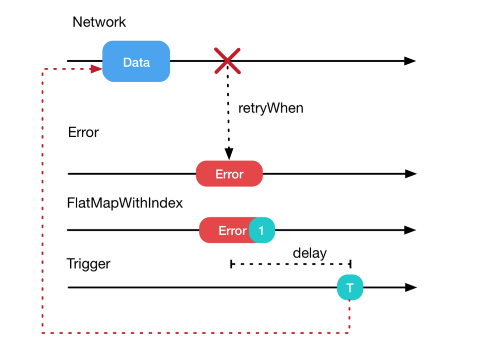
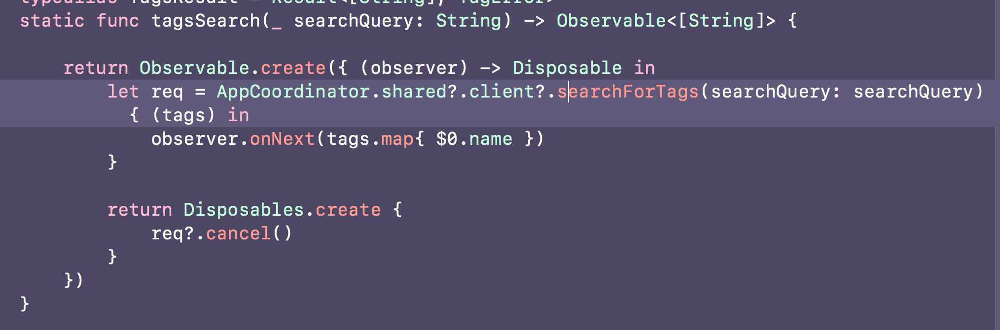

autoscale: true
theme: Poster,1
slidenumbers: true

# Refactoring your app in Rx

---

# Prelude

^ Hello Everyone! It’s an honour and pleasure to speak here. Round of applause for the  speakers and organizers. Great job everyone. <Press next NOW>

---

# 👏👏👏

^ <clap with everyone>

---
[.build-lists: true]

# Show of hands ✋

1. How many people here’ve heard of Functional Reactive Programming?
2. How many people here’ve heard of Reactive Swift/RxSwift?
3. How many people here’ve used Reactive Swift/RxSwift?

^ Don’t forget to announce the percentages for video reasons

---

What this talk is _**NOT**_ about

^ First, lets talk about what this talk is NOT about

---

- Introduction to RxSwift

^ <Tap Next>

---

- ~~Introduction to RxSwift~~

^ It isn’t an introduction to Rx, observables or reactive programming. It’s a complicated topic, you need to rewire your brain quite a bit to think reactively.

---


^ Trust me, I tried.

---

-  RxSwift with MVVM

^ <Tap Next>

---

- ~~RxSwift with MVVM~~

^ That’s a whole other ball game, and there's already been multiple talks about this

---

Stories
Examples
Experiences

^ What this talk **will** be, is a bunch of stories around how we refactored large parts of our app using Rx, and the stuff we found useful.

---


^ Now, a lot of you might be going. 

I DON'T KNOW RxSwift 😰

^And that's all right

---

>Conferences aren’t about learning things, they’re about learning *what* to learn, about networking, and meeting great people.
-- Someone on Twitter

^ No one’s gonna turn into an FP talk after watching 15 slides of maps/flatmaps. No one’s gonna turn into Peter Norvig after a 20 minute ML talk. Sorry Mugunth

---

So chill ❄

^ and lets get to work

---

# 2.0.0 🎉🎉🎉

^ We started refactoring large parts of our app using RxSwift for our 2.0.0 release. We had lots of fun and interesting challenges, shipping actual features and value to customers all while writing testable and maintainable code.

---

^ Before covering these examples, I'll go over some bits on Networking that'll help you understand some of the stuff I'll be covering

# Networking

---

Rx ➡ streams of values over time.
Sockets ➡ streams of data packets over time on a wire
➡ Rx ❤️ Sockets

^ Let's talk about websockets first

^ Thus, Rx translates really well for things like websockets, cos websockets are packets over a wire over time.  We’ve even written our own wrappers around existing websocket clients for our app, and things like network disconnections, event subscriptions(telling the server what events I want to listen to) etc. are handled _really_ well. (link to repo that we'll be open sourcing soon 😉)


---

## What about HTTP requests?


^ You know, where you make a request and you get a response. And there’s just one response. Not very stream-ey, is it? Is Rx still useful for them?

^ Here’s the thing. Requests don’t exist in isolation. Often they’re part of a bigger flow, like refreshing expired OAuth tokens, retrying n attempts if your server is down with exponentially  increasing time, waiting for Reachability to tell you that there actually is a network connection. Which is why often you don’t deal with a single request by itself in your application flow. We’ll discuss this stuff in detail later, but I brought this up early because there’s this really cool function that has some interesting use cases in Rx. It’s called flatMapLatest

---

## `flatMapLatest()`

---


^ Functions like map, filter etc exist in Rx and they do exactly what you expect since observables behave like swift's sequence types

---


^ What about flatMap? Well, flatmap takes an Observable of Observables, and “flattens” them. If you’ve worked with the flatmap function on top of optionals or nested arrays in swift, this probably makes sense to you. Lets do a demo right now to figure this stuff out

---

# Live Demo 🤓 🖥

^ https://rxfiddle.net/
^ Demo snippets in demo.md

---

# Notification Preferences

^ We shipped notifications with our app in 2.0.0, and we needed to have preferences so the user can opt-in/out of certain notification types

---


^Pretty standard UI, but we weren't big fans of the save-cancel buttons. We wanted something that the users didn't want to put much thought towards and felt _automatic_

---


^This is what they looked like on android and iOS

---


^This is what the request looks like. Nothing special. IDs and true/false pairs

---

## _Maximize_ responsiveness _Minimize_ requests

---

## First idea: a request queue 🤔

---

 

^ Our first idea came from our android dev - implement a request queue. We’d used one recently for sending messages in our app, and this’d be a good technical fit for reuse. Problem is, this’d mean one request for every switch, which could mean if the user moved 5 UISwithces, there’d be 5 requests in serial order which would be very high latency

---

## Consistency 💯
## Latency 😞

---

# State

1. Dictionary of `[id: Bool]`
2. only send a dictionary if state has _actually_ changed

^ We decided we would do the ideal thing, which’d involve keeping track of the “state” - think of it as a `[“id”:  Bool]` dictionary, and only send a request every few seconds if the state actually changed. This way, if a user turned a switch on, then off, a new request wouldn’t be sent at all!

---

# Imperative approach

- It. Was. Hell.

^ We tried an imperative approach first because our Rx skills were relatively raw

---

```
let timer: Timer
let request: DataRequest

// every time state actually changed
{
	timer.invalidate()
	self.request = client.createNewRequest()
	// wait for that callback to complete
}
```

---

Imagine if we added desktop preferences (sizes exaggerated for visibility reasons 😉)


---

```
let timer: Timer
let request: DataRequest

```

---

```
let mobileTimer: Timer
let mobileRequest: DataRequest
let desktopTimer: Timer
let desktopRequest: DataRequest

// and the checks would be worse too
```

---

This gets untenable _very_ quickly

---

# With Rx


^ In contrast, the approach was delightfully simple. We combined the 5 switches into a single signal, (ignore the asObservable for now, it's an implementation detail), debounce makes sure it fires only if nothing has changed for 3s so we're not hammering our server with requests, distinctUntilchanged makes sure state has actually changed. Then we subcribe to those changes, and we get an array of tuples in our closure, where we can fire off a request

---

and if we wanted to cancel requests automagically ✨ , we have our good old friend `flatMapLatest`


^ So, now so much weird mutable state is now just handled all well for free! and we get a list of preferences in the `subscribe` callback that we can use in our UI!

---

# Online Indicators

---


^ How many people here've watched the WWDC "crusty" talk by Dave Abrahammson?

^(skip if enough people say yes) It's a session by Dave Abrahammson on the Swift Standard library team about protocol oriented programming. Really enjoyable, actually was repeated in 2016 as well. I highly recommend you watch this talk


---


^ Explain the delegate approach

^ Let's do POP like all good swift programmers. And in our actual code, we’d update from a network client. In our tests, we’d just broadcast events and test for the indicator appearing.

^ In fact, there's nothing wrong with this approach. It's perfect, uses swift's paradigms and is also testable.

^ One Problem though

---

# 🤔

^ Problem with this approach is, you have to **think**. THINKING. IS. HARD. There’s a reason why most talks about testing in conferences have like super experienced grizzled old devs - it takes experience (and lots of it) to write testable code well. 

^ Let's try an alternative using Rx

---


^ For our tests, we can hook them up to an Observable we created ourselves. And for our app code, we can hook it up to our websocket connection. What's cool about this approach is that Rx helps us define a contract, and has good primitive types(like observables) to mock that contract

---


^ So now we get testability for free 🎉🎉🎉🎉🎉 without adding a new protocol type that would've otherwise been additional cognitive load

---

## Testability + Prototyping = 🤝

^ While we're on the topic of testability, one advantage of making your code testable is that it also makes prototyping easier 🎉

---


^ We had this view we call the "Presence bar" and shows the avatars of the users looking at the same conversation as you in our app(and animates them in and out). Lots of layout code, lots of interactions and animations to test out. Now, logging in and out as 20 different users while we were testing stuff out would've been a royal pain.

---


^ Instead, we initialize the view with an observable, and again, just like before, use our own observable while prototyping and swap out with one from our network in the actual app. Now, we needed an easy way to add and remove users from the view on demand, for prototyping.

---


^ In order to do that, we abstracted away the view into it's own framework and put it inside it's own app. We added a UIStepper and now we need to wire them together. What's a good way to make an observable that can send arbitrary events?

---


# Subjects

^ We’re using an Rx data structure called a subject. These act as both observers **and** observables. So, you can send events *TO* them, and all their subscribers receive their events. They’re like walkie talkies. Lots of people can broadcast on the same frequency, and anyone listening in, gets everything they’re saying.

^ (Let's not talk about threading just yet, cos it makes things complicated) in case someone points out threading

---


^ The best part about them is that you can use _only_ the observable bits using the `asObservable()` function. So now... you can send arbitrary events to my view and prototype as I wish, not limited to a view or a delegate method or whatever

---


^ so now it was really easy for us to test out scenarios for adding and removing users(Notice the number counter thing)

---


^ and even things like landscape. Again, it's not that protocols are bad or inefficient. It's just that Rx gives us a good set of primitives to work with and easily prototype + test code. It really makes this stuff effortless. Before, if a designer asked me for help with prototyping something, I'd go crazy thinking about making MVPs, keeping code clean doing all this extra work. Now, it's just a flick of a switch ✨


---

## Networking (Again!)

---

[.build-lists: true]

# Things I want in my networking client

1. Testability
2. Should do exactly what it says. No 🐒 patching.

^ There’s 2 things I really care about with my API Client. 
^1. It should be testable
^2. Should do exactly what it says. I’m dead against the idea of a client refreshing tokens and doing things “behind the scenes” by itself without telling the application. This is useful because your client can be used in contexts other than your app, in say a script or on the server!

---

Average API Client (with Foundation)


^ Testing this is incredibly easy, pass in a subclassed session object and override any of the dataTask methods in your tests

---

```swift
func createBody(parameters: [String: String], boundary: String, file: AttachmentCreationModel?) -> Data {
		let body = NSMutableData()
		
		let boundaryPrefix = "--\(boundary)\r\n"
		
		for (key, value) in parameters {
			body.appendString(boundaryPrefix)
			body.appendString("Content-Disposition: form-data; name=\"\(key)\"\r\n\r\n")
			body.appendString("\(value)\r\n")
		}
		
		body.appendString(boundaryPrefix)
		
		if let file = file {
			body.appendString("Content-Disposition: form-data; name=\"files[\(index)]\"; filename=\"\(file.filename)\"\r\n")
			body.appendString("Content-Type: \(file.mimeType)\r\n\r\n")
			body.append(file.data)
			body.appendString("\r\n")
			body.appendString("--".appending(boundary.appending("--")))
		}
		
		return body as Data
	}
```

^One problem tho. Ever wrote multipart form upload in URLSession?

---

URLSession Features 😞👎
URLSession Testability 💯

^ Ever tried writing multipart form in URLSession? It's frustrating as hell. URLSession is designed as a really low level bare bones API. Which is why alternatives exist like....

---

Average API Client (with Alamofire)


---


^ Alamofire has lots of features (which is why we all love it). For example, it has its own networking retrial implementation

---

```swift
class OAuth2Handler: RequestAdapter, RequestRetrier {
    private typealias RefreshCompletion = (_ succeeded: Bool, _ accessToken: String?, _ refreshToken: String?) -> Void

    private let sessionManager: SessionManager = {
        let configuration = URLSessionConfiguration.default
        configuration.httpAdditionalHeaders = SessionManager.defaultHTTPHeaders

        return SessionManager(configuration: configuration)
    }()

    private let lock = NSLock()

    private var clientID: String
    private var baseURLString: String
    private var accessToken: String
    private var refreshToken: String

    private var isRefreshing = false
    private var requestsToRetry: [RequestRetryCompletion] = []

    // MARK: - Initialization

    public init(clientID: String, baseURLString: String, accessToken: String, refreshToken: String) {
        self.clientID = clientID
        self.baseURLString = baseURLString
        self.accessToken = accessToken
        self.refreshToken = refreshToken
    }

    // MARK: - RequestAdapter

    func adapt(_ urlRequest: URLRequest) throws -> URLRequest {
        if let urlString = urlRequest.url?.absoluteString, urlString.hasPrefix(baseURLString) {
            var urlRequest = urlRequest
            urlRequest.setValue("Bearer " + accessToken, forHTTPHeaderField: "Authorization")
            return urlRequest
        }

        return urlRequest
    }

    // MARK: - RequestRetrier

    func should(_ manager: SessionManager, retry request: Request, with error: Error, completion: @escaping RequestRetryCompletion) {
        lock.lock() ; defer { lock.unlock() }

        if let response = request.task?.response as? HTTPURLResponse, response.statusCode == 401 {
            requestsToRetry.append(completion)

            if !isRefreshing {
                refreshTokens { [weak self] succeeded, accessToken, refreshToken in
                    guard let strongSelf = self else { return }

                    strongSelf.lock.lock() ; defer { strongSelf.lock.unlock() }

                    if let accessToken = accessToken, let refreshToken = refreshToken {
                        strongSelf.accessToken = accessToken
                        strongSelf.refreshToken = refreshToken
                    }

                    strongSelf.requestsToRetry.forEach { $0(succeeded, 0.0) }
                    strongSelf.requestsToRetry.removeAll()
                }
            }
        } else {
            completion(false, 0.0)
        }
    }

    // MARK: - Private - Refresh Tokens

    private func refreshTokens(completion: @escaping RefreshCompletion) {
        guard !isRefreshing else { return }

        isRefreshing = true

        let urlString = "\(baseURLString)/oauth2/token"

        let parameters: [String: Any] = [
            "access_token": accessToken,
            "refresh_token": refreshToken,
            "client_id": clientID,
            "grant_type": "refresh_token"
        ]

        sessionManager.request(urlString, method: .post, parameters: parameters, encoding: JSONEncoding.default)
            .responseJSON { [weak self] response in
                guard let strongSelf = self else { return }

                if 
                    let json = response.result.value as? [String: Any], 
                    let accessToken = json["access_token"] as? String, 
                    let refreshToken = json["refresh_token"] as? String 
                {
                    completion(true, accessToken, refreshToken)
                } else {
                    completion(false, nil, nil)
                }

                strongSelf.isRefreshing = false
            }
    }
}
let baseURLString = "https://some.domain-behind-oauth2.com"

let oauthHandler = OAuth2Handler(
    clientID: "12345678",
    baseURLString: baseURLString,
    accessToken: "abcd1234",
    refreshToken: "ef56789a"
)

let sessionManager = SessionManager()
sessionManager.adapter = oauthHandler
sessionManager.retrier = oauthHandler

let urlString = "\(baseURLString)/some/endpoint"

sessionManager.request(urlString).validate().responseJSON { response in
    debugPrint(response)
}

```

^ Reallllly llooooooonnnng and boring code

---

Alamofire Features 💯
Alamofire Testability 😞👎

^ Alamofire OTOH is _really_ hard to test (you have to resort to runtime trickery) and solves lots of problems around retrial using it’s own weird constructs around request adapters and request retriers, effectively moving your solution to a level in the stack below your API client, which is 😒 https://github.com/kylef/Mockingjay/blob/master/Sources/Mockingjay/MockingjayURLSessionConfiguration.m

---


^ What about Rx? Well, we can sort of get the best of both worlds (with the first example using NSURLSession). I’m probably running a little short of time here, but let’s go quickly over the operator. It’s called `retry` - it resubscribes to the observable hoping a new error isn't returned) and has a couple of variations. The most important one is called `retryWhen` (This code snippet is from the raywenderlich RxSwift book btw. Amazing, totally recommend. Asked Marin Todorov for permission in the rx slack)

^ flatMapWithIndex - just adds an index

^ this entire handler can handle invalid tokens (1 in the photo), bad connections(2) (and use reachability to ✨magically retry a request if the connection is bad) and ALSO retry requests every second 😎. All without being locked into alamofire. Note that most apps don't even care about this stuff - like for a network failure most people just show an error alert and expect the user to do a pull to refresh or something. This elevates your app's user experience quite a bit!

^ All you need to do is attach this at the end of your request observable

---



---


^ I’ve been personally experimenting with this library called Networking(which is a very thin convenience wrapper around `URLSession` and Rx. Will try OSSing some stuff soon

---

But I don't wanna rewrite my code 😢

---



---

## What about Management 👩‍💼👨‍💼

^Sooo.... Now you're gonna go back to work after this wonderful conference is over and ask your boss "Hey! Robin told me about this excellent RxSwift library and I wanna use it"

^ They'll probably say: "Last time you suggested a major change (moving to swift), we spent weeks migrating code between versions. Yesterday you suggested writing server side swift. Why should I trust you?""

---

# Make the case for it!!

^ Often when dealing with a new paradigm, you’ll get pushback from senior engineers. And while it’s really justified ( uses MVC, why go against the current? Didn’t you _just_ switch languages 2 years ago), I personally think it’s worth the future costs to use Rx in production apps right now. It remains a fact that  doesn’t exist in a vacuum, and looks at the community for inspiration. Who would’ve thought 4 years ago that they’d make a language with `map`, `reduce` and `filter` as first class citizens? IIRC Apple also has used ReactiveCocoa in one of their demo apps (it’s the thing that runs on macs in the demo mode). I genuinely believe that reactive programming has a bright future in the  ecosystem

---

# Final words

---

RxSwift is _**not**_ always the best way to solve a problem

^ Remember, RxSwift is not always the best way to solve a problem, but you kinda have to know when to use it to its full potential. We've gone over lots of examples where it's been excellent, but it doesn't stop you from shooting yourself in the foot. I hear a lot of people saying "Oh, with Rxswift you don't worry about threading" or "RxSwift makes your code fast".  What it _does_ do is give a good set of primitives and a foundation to <move to next slide>

---

# Build Great Apps 👏🎉🎊

^And that's really what we want, don't we?

---


