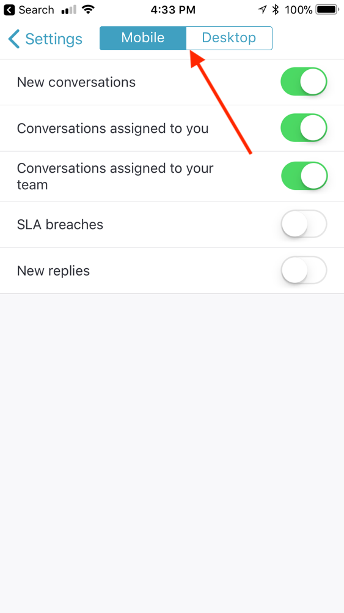
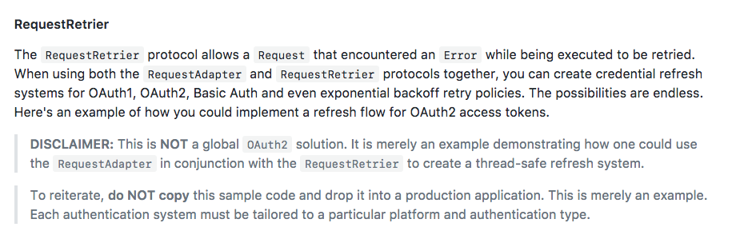

autoscale: true
theme: Poster,1
slidenumbers: true

# Refactoring your app in Rx

---

# Prelude

^ Hello Everyone! It’s an honour and pleasure to speak here. Round of applause for the  speakers and organizers. Great job everyone .

---

# 👏👏👏

---
[.build-lists: true]

# Show of hands ✋

1. How many people here’ve heard of Functional Reactive Programming?
2. How many people here’ve heard of Reactive Swift/RxSwift?
3. How many people here’ve used Reactive Swift/RxSwift?

^ Don’t forget to announce the percentages for video reasons

---

What this talk is _**NOT**_ about

---

- Introduction to RxSwift

---

- ~~Introduction to RxSwift~~

---

^ It isn’t an introduction to Rx, observables or reactive programming. It’s a complicated topic, you need to rewire your brain quite a bit to think reactively. Trust me, I tried.


---

-  RxSwift with MVVM

---

- ~~RxSwift with MVVM~~

^ That’s a whole other ball game, and really hard to explain in a 20 minute session.

---

Stories
Examples
Experiences

^ What this talk **will** be, is a bunch of stories around how we refactored large parts of our app using Rx, and the stuff we found useful.

---

I DON'T KNOW RxSwift 😰

^ Now, a lot of you might be going
^ And that's all right

---

>Conferences aren’t about learning things, they’re about learning *what* to learn, about networking, and meeting great people.
-- Someone on Twitter

^ No one’s gonna turn into an FP talk after watching 15 slides of maps/flatmaps. No one’s gonna turn into Peter Norvig after a 20 minute ML talk. Sorry Mugunth

---

So chill ❄

^ and lets get to work

---

# 2.0.0 🎉🎉🎉

^ We started refactoring large parts of our app using RxSwift for our 2.0.0 release. We had lots of fun and interesting challenges, shipping actual features and value to customers all while writing testable and maintainable code.

---

^ Before covering these examples, I'll go over some bits on Networking that'll help you understand some of the stuff I'll be covering

# Networking

---

Rx ➡ streams of values over time.
Sockets ➡ streams of data packets over time on a wire
➡ Rx ❤️ Sockets

^ Thus, Rx translates really well for things like websockets, cos websockets are packets over a wire over time.  We’ve even written our own wrappers around existing websocket clients for our app, and things like network disconnections, event subscriptions etc. are handled _really_ well. (link to repo)


---

## What about HTTP requests?


^ You know, where you make a request and you get a response. And there’s just one response. Not very stream-ey, is it? Is Rx still useful for them?

^ Here’s the thing. Requests don’t exist in isolation. Often they’re part of a bigger flow, like refreshing expired OAuth tokens, retrying n attempts if your server is down with exponentially  increasing time, waiting for Reachability to tell you that there's a network connection. Which is why often you don’t deal with a single request by itself in your application flow. We’ll discuss this stuff in detail later, but I brought this up early because there’s this really cool function that has some interesting use cases in Rx. It’s called flatMapLatest

---

## `flatMapLatest()`

---


^ Functions like map, filter etc exist in Rx and they do exactly what you expect since observables behave like swift's sequence types

---


^ What about flatMap? Well, flatmap takes an Observable of Observables, and “flattens” them. If you’ve worked with the flatmap function on top of optionals or arrays in swift, this probably makes sense to you. Lets do a demo right now to figure this stuff out

---

# Live Demo 🤓 🖥

^ https://rxfiddle.net/
^ Demo snippets in demo.md

---

# Notification Preferences

^ We shipped notifications with our app in 2.0.0, and we needed to have preferences so the user can opt-in/out of certain notification types

---


^Pretty standard UI, but we weren't big fans of the save-cancel buttons. We wanted something that the users didn't want to put much thought towards and felt _automatic_

---


^This is what they looked like on android and iOS

---


---

## _Maximize_ responsiveness _Minimize_ requests

---

## First idea: a request queue 🤔

---

 

^ Our first idea came from our android dev - implement a request queue. We’d used one recently for sending messages in our app, and this’d be a good technical fit for reuse. Problem is, this’d mean one request for every switch, which could mean if the user moved 5 UISwithces, there’d be 5 requests in serial order which would be very high latency

---

## Consistency 💯
## Latency 😞

---

# State

1. Dictionary of `[id: Bool]`
2. only send a dictionary if state has _actually_ changed

^ We decided we would do the ideal thing, which’d involve keeping track of the “state” - think of it as a `[“id”:  Bool]` dictionary, and only send a request every few seconds if the state actually changed. This way, if a user turned a switch on, then off, a new request wouldn’t be sent at all!

---

# Imperative approach

- It. Was. Hell.

---

```
let timer: Timer
let request: DataRequest

// every time state actually changed
{
	timer.invalidate()
	self.request = client.createNewRequest()
	// wait for that callback to complete
}
```

---

Imagine if we added desktop preferences (sizes exaggerated for visibility reasons 😉)



---

```
let timer: Timer
let request: DataRequest

```

---

```
let mobileTimer: Timer
let mobileRequest: DataRequest
let desktopTimer: Timer
let desktopRequest: DataRequest

// and the checks would be worse too
```

---

This gets untenable _very_ quickly

---

# With Rx


^ In contrast, the approach was delightfully simple. We combined the 5 switches into a single signal, (ignore the asObservable for now, it's an implementation detail), debounce makes sure it fires only if nothing has changed for 3s so we're not hammering our server with requests, distinctUntilchanged makes sure state has actually changed. Then we subcribe to those changes, and we get an array of tuples in our closure, where we can fire off a request

---

and if we wanted to cancel requests automagically ✨ , we have our good old `flatMapLatest`


^ So, now so much weird mutable state is now just handled all well for free! and we get a list of preferences for our UI

---

# Online Indicators

---


^ Let's do POP like all good swift programmers who've seen Dave Abrahammson's WWDC talk. And in our actual code, we’d update from a network client. In our tests, we’d just broadcast events and test for the indicator appearing

^ In fact, there's nothing wrong with this approach. It's perfect, uses swift's tools and is also testable.

^ One Problem though

---

# 🤔

^ Problem with this approach is, you have to **think**. THINKING. IS. HARD. There’s a reason why most talks about testing in conferences have like 40 year old grizzled devs - it takes experience (and lots of it) to write testable code well.

---

# Subjects

^ We’re using an Rx data structure called a subject. These act as both observers **and** observables. So, you can send events *TO* them, and all their subscribers receive their events. They’re like radios. Lots of people can broadcast on the same frequency, and anyone listening in, gets everything they’re saying. (Let's not talk about threading just yet, cos it makes things complicated). The best part about them is that you can use _only_ the observable bits using the `asObservable()` function


^ For our tests, we can hook them up to an Observable we created ourselves. And for our app code, we can hook it up to our websocket connection

---


^ So now we get testability for free 🎉🎉🎉🎉🎉

---

## Networking(Again!)

---

Average API Client (with Foundation)


---

Average API Client (with Alamofire)


---

# Things I want in my networking client

1. Testable
2. Should do exactly what it says. No 🐒 patching.

^ There’s 2 things I really care about with my API Client. 
^1. It should be testable
^2. Should do exactly what it says. I’m dead against the idea of a client refreshing tokens and doing things “behind the scenes” by itself without telling the application. This is useful because your client can be used in contexts other than your app, in say a script or on the server!

---



^ Alamofire has lots of features (which is why we all love it). For example, it has its own networking retrial implementation

---

Alamofire Features 💯
Alamofire Testability 😞👎

^ Alamofire OTOH is _really_ hard to test (you have to resort to runtime trickery) and solves 2 using it’s own weird constructs around request adapters and request retriers, effectively moving your solution to a level in the stack below your API client, which is 😒

---


^ What about Rx? Well, we can sort of get the best of both worlds (with the first example using NSURLSession). I’m probably running a little short of time here, but let’s go quickly over the operator. It’s called `retry` and has a couple of variations. The most important one is called `retryWhen`

^ this entire handler can handle invalid tokens (1 in the photo), bad connections(2) (and use reachability to ✨magically retry a request if the connection is bad) and ALSO retry requests otherwise with an exponential backoff 😎. All without being locked into alamofire.

---


^ I’ve been personally experimenting with this library called Networking(which is a very thin convenience wrapper around `URLSession` and Rx.

---

But I don't wanna rewrite 😢

---


---

## What about Management 👩‍💼👨‍💼

---

# Make the case for it!!

^ Last time we did a major change (moving to swift), you spent weeks migrating code between versions. Yesterday you suggested writing server side swift. Why should I trust you?

^ Often when dealing with a new paradigm, you’ll get pushback from senior engineers. And while it’s really justified ( uses MVC, why go against the current? Didn’t you _just_ switch languages a year ago), I personally think it’s worth the future costs to use Rx in production apps right now. It remains a fact that  doesn’t exist in a vacuum, and looks at the community for inspiration. Who would’ve thought 4 years ago that they’d make a language with `map`, `reduce` and `filter` as first class citizens? IIRC Apple also has used ReactiveCocoa in one of their demo apps (it’s the thing that runs on macs in the demo mode). I genuinely believe that reactive programming has a bright future in the  ecosystem

---

# Final words

---

RxSwift is _**not**_ always the best way to solve a problem

^ Remember, RxSwift is not always the best way to solve a problem, but you kinda have to know when to use it to its full potential. We've gone over lots of examples where it's been excellent, but it doesn't stop you from shooting yourself in the foot. It doesn't solve all your threading woes for example. What it _does_ do is give a good set of primitives and a foundation to (move to next slide) 

---

# Build Great Apps 👏🎉🎊

^And that's really what we want, don't we?

---


